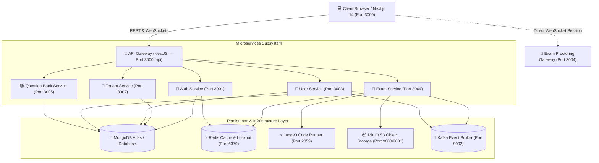
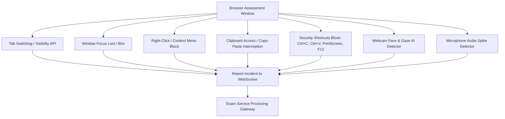

# 📘 Xe-Recruiters: Complete Project Master Study Guide
### *Comprehensive From-Scratch Architectural, Codebase, Microservices, and Feature Deep Dive*

---

## 📑 Table of Contents
1. [Executive Summary & Core Value Proposition](#1-executive-summary--core-value-proposition)
2. [Monorepo & Workspace Architecture](#2-monorepo--workspace-architecture)
3. [End-to-End System Architecture](#3-end-to-end-system-architecture)
4. [Shared Packages Layer](#4-shared-packages-layer)
   - 4.1 `@xe-recruiters/shared-types`
   - 4.2 `@xe-recruiters/shared-utils`
5. [Database Architecture & Prisma Data Models (By Service)](#5-database-architecture--prisma-data-models-by-service)
   - 5.1 Auth Service Schema (`auth-service/prisma/schema.prisma`)
   - 5.2 Tenant Service Schema (`tenant-service/prisma/schema.prisma`)
   - 5.3 User Service Schema (`user-service/prisma/schema.prisma`)
   - 5.4 Question Bank Service Schema (`question-bank-service/prisma/schema.prisma`)
   - 5.5 Exam Service Schema (`exam-service/prisma/schema.prisma`)
6. [Deep Dive into Microservices Subsystems](#6-deep-dive-into-microservices-subsystems)
   - 6.1 API Gateway (Port 3000 /api)
   - 6.2 Auth Service (Port 3001)
   - 6.3 Tenant Service (Port 3002)
   - 6.4 User Service (Port 3003)
   - 6.5 Question Bank Service (Port 3005)
   - 6.6 Exam Service & Proctoring Gateway (Port 3004)
7. [Code Execution Engine Subsystem (Judge0 CE Integration)](#7-code-execution-engine-subsystem-judge0-ce-integration)
8. [Automated Dynamic Certificate Generation Engine](#8-automated-dynamic-certificate-generation-engine)
9. [AI & Live Human Proctoring Engine](#9-ai--live-human-proctoring-engine)
   - 9.1 Client-Side Proctoring Enforcement (`useProctoring.ts`)
   - 9.2 Real-time Trust Score Algorithm (0–100%)
   - 9.3 WebSocket Proctoring Gateway (`proctoring.gateway.ts`)
   - 9.4 Human Proctor Live Supervision Grid
10. [Frontend Architecture & Next.js 14 App Router](#10-frontend-architecture--nextjs-14-app-router)
    - 10.1 Directory Layout & Routing Hierarchy
    - 10.2 State Management (Zustand & Stores)
    - 10.3 API Client Layer (`lib/api.ts`)
    - 10.4 Dashboard Pages Breakdown
11. [Infrastructure, Docker Compose & Seeding Scripts](#11-infrastructure-docker-compose--seeding-scripts)
    - 11.1 `docker-compose.yml` Services Matrix
    - 11.2 Seeding Scripts & Pre-configured Test Accounts
12. [End-to-End Workflow Lifecycles (Step-by-Step)](#12-end-to-end-workflow-lifecycles-step-by-step)
    - 12.1 Exam Lifecycle (Draft → Publish → Assign → Take → Grade → Certify)
    - 12.2 Proctoring Incident Lifecycle
    - 12.3 Candidate Code Execution & Auto-Test Flow
13. [Quick Revision / Viva Q&A Guide](#13-quick-revision--viva-qa-guide)

---

## 1. Executive Summary & Core Value Proposition

**Xe-Recruiters** is an enterprise-grade, multi-tenant assessment and AI-proctored examination platform designed for universities, enterprises, and technical recruiting agencies.

### Key Capabilities:
- **Multi-Tenant Isolation**: Complete white-labeling (custom branding, domain mapping, custom security policies, retention periods, and seat licenses per organization).
- **5-Tier Role-Based Access Control (RBAC)**: `PLATFORM_ADMIN`, `TENANT_ADMIN`, `TEACHER`, `PROCTOR`, and `CANDIDATE`.
- **Hybrid Proctoring Subsystem**:
  1. *AI Automated Proctoring*: Face detection, multiple face presence, head-pose/gaze deviation, ambient noise detection, tab-switch interception, full-screen locks, clipboard disabling, and keystroke anomaly tracking.
  2. *Live Human Proctoring Grid*: Low-latency multi-candidate video monitoring, active warning dispatch, session pause, and remote forced termination.
- **Judge0 CE High-Performance Code Execution**: Real-time sandboxed code compiler for Python, JavaScript, C++, and Java with automated evaluation against public & hidden test suites.
- **Dynamic PDF Certificate Engine**: Automated cryptographic completion certificate generation with SHA-256 verification hash and public verification portal.
- **GDPR / Compliance Suite**: Built-in Data Subject Access Request (DSAR) export and account deletion workflows, plus immutable security audit trails.

---

## 2. Monorepo & Workspace Architecture

The project is structured as a **Turborepo** monorepo using npm workspaces (`npm >= 10.0.0`, `Node.js >= 20.0.0`).

### Workspace Layout:
```text
xebia-exam-platform/
├── packages/                   # Reusable library packages
│   ├── shared-types/           # Central TypeScript types, DTOs, and Enums
│   └── shared-utils/           # Response formatters, exceptions, logger, crypto helpers
├── services/                   # NestJS Microservices
│   ├── api-gateway/            # Unified REST entrypoint & reverse proxy (Port 3000/api)
│   ├── auth-service/           # JWT, Sessions, Password Resets (Port 3001)
│   ├── tenant-service/         # Multi-tenant management, Branding, Settings (Port 3002)
│   ├── user-service/           # User lifecycle, RBAC, Groups, DSAR (Port 3003)
│   ├── exam-service/           # Exams, Assignments, Proctoring WS, PDF Certs (Port 3004)
│   └── question-bank-service/  # Item bank (MCQs, Coding, Subjective) (Port 3005)
├── frontend/                   # Next.js 14 App Router Portal (Tailwind CSS, Zustand)
├── docker-compose.yml          # Containerized dependencies (Postgres, Redis, Kafka, MinIO, Judge0)
├── turbo.json                  # Turborepo build & dev pipeline definitions
└── seed_real_proctor_data.js   # Master database seeder
```

### Why Turborepo?
- **Pipeline Orchestration**: Executes tasks (`dev`, `build`, `lint`, `typecheck`) concurrently across all services and frontend.
- **Incremental Builds & Caching**: Rebuilds only modified packages using dependency hashing.
- **Workspace Resolution**: Direct TypeScript resolution between `packages/*` and `services/*` without needing external npm publishing.

---

## 3. End-to-End System Architecture



### Communication Protocols:
- **Frontend ↔ API Gateway**: HTTP/HTTPS REST (`/api/v1/*`) with Bearer JWT headers.
- **Frontend ↔ Exam Service**: Socket.IO WebSockets for real-time proctor video frames, incidents, warnings, and terminations.
- **Exam Service ↔ Judge0**: REST API (`/submissions?wait=true`) with payload containing source code, language ID, stdin, and expected output.
- **Inter-service Event Streaming**: Kafka event topics for domain events (`exam.submitted`, `user.created`, `proctor.incident`).

---

## 4. Shared Packages Layer

### 4.1 `@xe-recruiters/shared-types` (`packages/shared-types/src/index.ts`)
Houses universal TypeScript types across frontend and backend:

#### Core Enums:
- `UserRole`: `PLATFORM_ADMIN`, `TENANT_ADMIN`, `EXAM_MANAGER`, `TEACHER`, `PROCTOR`, `CANDIDATE`.
- `TenantStatus`: `ACTIVE`, `INACTIVE`, `SUSPENDED`, `TRIAL`.
- `ExamStatus`: `DRAFT`, `PUBLISHED`, `SCHEDULED`, `IN_PROGRESS`, `COMPLETED`, `ARCHIVED`.
- `QuestionType`: `MCQ`, `MRQ`, `PROGRAMMING`, `TRUE_FALSE`, `SHORT_ANSWER`, `ESSAY`.
- `DifficultyLevel`: `EASY`, `MEDIUM`, `HARD`, `EXPERT`.
- `IncidentType`: `FACE_ABSENT`, `MULTIPLE_FACES`, `HEAD_POSE_DEVIATION`, `EYE_GAZE_DEVIATION`, `TAB_SWITCH`, `WINDOW_BLUR`, `CLIPBOARD_ACCESS`, `SCREEN_SHARE_STOPPED`, `CAMERA_DISCONNECTED`, `MIC_ANOMALY`, `NETWORK_INTERRUPTION`.
- `TrustScoreLevel`: `HIGH` (80–100%), `MEDIUM` (50–79%), `LOW` (30–49%), `CRITICAL` (<30%).
- `NavigationRule`: `FREE` (free jumping), `LINEAR` (one-way sequential), `SECTION_LOCKED` (timed sections).

#### Standard API DTOs:
- `ApiResponse<T>`: Standard format `{ success: boolean, data?: T, error?: { code, message, details }, timestamp: string }`.
- `PaginatedResponse<T>`: Standard pagination payload `{ data: T[], meta: { total, page, limit, totalPages, hasNextPage, hasPreviousPage } }`.
- `JwtPayload`: Decoded token structure `{ sub, email, tenantId, role, iat, exp }`.

---

### 4.2 `@xe-recruiters/shared-utils` (`packages/shared-utils/src/index.ts`)
Shared utility functions, response helpers, and exception classes:

- **Response Helpers**:
  - `successResponse(data, meta)`: Wraps payload in standard `ApiResponse`.
  - `errorResponse(message, code, details)`: Formats error responses.
  - `createPaginatedResponse(data, total, page, limit)`: Calculates pagination metadata.
- **Crypto & ID Generator**:
  - `generateId()`: Generates 24-character hexadecimal MongoDB ObjectId compatible string.
  - `generateToken(bytes)`: Generates secure random cryptographic hex string.
  - `hashString(input)`: SHA-256 hash calculation for verification signatures.
- **Centralized Logger**:
  - `createLogger(serviceName)`: Structured JSON and colored terminal logger.

---

## 5. Database Architecture & Prisma Data Models (By Service)

Each microservice maintains its own independent Prisma Schema connecting to dedicated logical databases in MongoDB (or PostgreSQL).

### 5.1 Auth Service (`services/auth-service/prisma/schema.prisma`)
| Model | Description | Key Fields |
| :--- | :--- | :--- |
| `Session` | Active user refresh sessions | `id`, `userId`, `tenantId`, `refreshToken`, `userAgent`, `ipAddress`, `expiresAt`, `isRevoked` |
| `PasswordReset` | Single-use password reset tokens | `id`, `userId`, `tenantId`, `token`, `expiresAt`, `usedAt` |
| `LoginAttempt` | Audit trail of all login events | `id`, `email`, `tenantId`, `ipAddress`, `userAgent`, `success`, `failReason` |
| `AccountLockout` | Brute-force prevention state | `id`, `email`, `tenantId`, `failedCount`, `lockedUntil` |

---

### 5.2 Tenant Service (`services/tenant-service/prisma/schema.prisma`)
| Model | Description | Key Fields |
| :--- | :--- | :--- |
| `Tenant` | Organization entity | `id`, `name`, `slug` (unique), `status`, `plan`, `maxSeats`, `usedSeats` |
| `TenantBranding` | White-label UI customization | `tenantId`, `logoUrl`, `primaryColor`, `secondaryColor`, `companyName`, `faviconUrl` |
| `TenantSettings` | Organization operational settings | `tenantId`, `timezone`, `locale`, `dateFormat`, `enableProctoring`, `maxConcurrentExams`, retention days |
| `ApiKey` | Programmatic API keys | `id`, `tenantId`, `name`, `key` (unique), `status` |
| `WebhookConfig` | Outbound webhooks | `id`, `tenantId`, `url`, `isActive` |
| `SecurityPolicy` | Password & lockout policies | `tenantId`, `passwordMinLength`, `requireSpecialChar`, `lockoutThreshold`, `lockoutDuration`, `firstLoginReset` |
| `SmtpConfig` | Custom email server settings | `tenantId`, `host`, `port`, `user` |
| `AuditLog` | Administrative action log | `tenantId`, `actor`, `action`, `details`, `ipAddress`, `status` |

---

### 5.3 User Service (`services/user-service/prisma/schema.prisma`)
| Model | Description | Key Fields |
| :--- | :--- | :--- |
| `User` | User profile & credentials | `id`, `tenantId`, `email`, `passwordHash`, `firstName`, `lastName`, `role`, `isActive`, `requiresPasswordReset`, `lastLoginAt` |
| `Invitation` | Email invitation workflow | `id`, `tenantId`, `email`, `role`, `token` (unique), `status`, `expiresAt`, `invitedBy` |
| `CandidateGroup` | Cohort / batch grouping | `id`, `tenantId`, `name` |
| `CandidateGroupMember` | Group membership mapping | `id`, `groupId`, `userId` |
| `DsarRequest` | GDPR data access & erasure | `id`, `userId`, `tenantId`, `type` (`EXPORT`/`DELETION`), `status` (`PENDING`/`COMPLETED`/`REJECTED`) |

---

### 5.4 Question Bank Service (`services/question-bank-service/prisma/schema.prisma`)
| Model | Description | Key Fields |
| :--- | :--- | :--- |
| `Question` | Master assessment item | `id`, `tenantId`, `type`, `title`, `body`, `explanation`, `difficulty`, `points`, `timeLimit`, `categoryId`, `testCases`, `programmingLanguage`, `solutionCode`, `templateCode` |
| `QuestionOption` | MCQ/MRQ choices | `id`, `questionId`, `text`, `isCorrect`, `order` |
| `QuestionTag` | Taxonomy tags for search | `id`, `questionId`, `tag` |
| `Category` | Hierarchical folder tree | `id`, `tenantId`, `name`, `description`, `parentId` |

---

### 5.5 Exam Service (`services/exam-service/prisma/schema.prisma`)
| Model | Description | Key Fields |
| :--- | :--- | :--- |
| `Exam` | Assessment blueprint | `id`, `tenantId`, `title`, `description`, `instructions`, `status`, `duration`, `totalMarks`, `passingScore`, `startTime`, `endTime`, `navigationRule`, `shuffleQuestions`, `shuffleOptions`, `enableProctoring`, `proctoringMode`, `proctoringFlags`, `sensitivityWarningLimit`, `sensitivityTerminationLimit`, `autoTerminateOnTrustLimit`, `negativeMarking`, `certificateIssuance` |
| `ExamSection` | Part / section within exam | `id`, `examId`, `title`, `description`, `order`, `timeLimit` |
| `ExamSectionQuestion` | Questions assigned to section | `id`, `sectionId`, `questionId`, `order`, `points` |
| `ExamAssignment` | Candidate exam sitting instance | `id`, `examId`, `tenantId`, `candidateId`, `status` (`ASSIGNED`, `IN_PROGRESS`, `SUBMITTED`, `GRADED`), `sessionStatus`, `startedAt`, `submittedAt`, `score`, `totalMarks`, `answers`, `attemptsUsed`, `trustScore` (0–100), `onboardingLogs`, `terminationReason`, `proctorWarnings` |
| `Certificate` | Completion credential | `id`, `tenantId`, `assignmentId`, `candidateId`, `candidateName`, `examId`, `examTitle`, `score`, `totalMarks`, `issuedAt`, `issuingOrg`, `signature` |
| `Incident` | Proctoring violation log | `id`, `assignmentId`, `timestamp`, `flagType`, `severity`, `confidenceScore`, `screenshot`, `reviewerDecision` (`PENDING`, `DISMISSED`, `WARNED`, `TERMINATED`), `reviewerReason`, `reviewerIdentity` |
| `ProctorDecisionLog` | Human proctor actions log | `id`, `assignmentId`, `incidentId`, `actionType`, `rationale`, `reviewerIdentity`, `timestamp` |

---

## 6. Deep Dive into Microservices Subsystems

### 6.1 API Gateway (`services/api-gateway`)
- **Port**: `3000` (Routes requests from `/api/v1/*` to downstream services).
- **Core Responsibilities**:
  - Unified entrypoint using `http-proxy-middleware` or NestJS HTTP Proxy module.
  - Route routing table:
    - `/api/v1/auth/*` → `http://localhost:3001`
    - `/api/v1/tenants/*` → `http://localhost:3002`
    - `/api/v1/users/*` → `http://localhost:3003`
    - `/api/v1/exams/*` → `http://localhost:3004`
    - `/api/v1/questions/*` → `http://localhost:3005`
    - `/api/v1/code-execution/*` → `http://localhost:3004` (hosted in Exam Service)
  - CORS configuration for local and cloud environments.
  - Global error catching and standard error envelope formatting.

---

### 6.2 Auth Service (`services/auth-service`)
- **Port**: `3001`
- **Key Operations**:
  - `POST /auth/register`: Candidate self-registration.
  - `POST /auth/login`: Authenticates credentials with bcrypt (`bcrypt.compare`), checks account lockout status in Redis/MongoDB, records `LoginAttempt`, creates a `Session` with refresh token, and returns `{ accessToken, refreshToken, user }`.
  - `POST /auth/refresh`: Validates refresh token from DB/cookie and issues a fresh short-lived JWT accessToken.
  - `POST /auth/logout`: Revokes the session and clears tokens.
  - `POST /auth/password-reset/request` & `POST /auth/password-reset/confirm`: Secure token-based password reset.
  - `POST /auth/first-login-reset`: Enforces initial password update on first login.

---

### 6.3 Tenant Service (`services/tenant-service`)
- **Port**: `3002`
- **Key Operations**:
  - `GET /tenants/current`: Resolves tenant details from host header or JWT.
  - `POST /tenants`: Provisions new tenant with default branding and settings.
  - `PUT /tenants/:id/branding`: Updates theme colors (`primaryColor`, `secondaryColor`), logo URL, and favicon.
  - `PUT /tenants/:id/settings`: Configures proctoring defaults, max concurrent exams, and retention policies.
  - `GET/POST /tenants/:id/api-keys`: Generates hashed API keys for external integration.
  - `GET/POST /tenants/:id/webhooks`: Registers webhooks for automated event dispatch.
  - `GET/POST /tenants/:id/audit-logs`: System audit trail recording all admin changes.

---

### 6.4 User Service (`services/user-service`)
- **Port**: `3003`
- **Key Operations**:
  - `GET /users`: Paginated list of users filtered by role, search keyword, and tenant.
  - `POST /users`: Directly creates a user account.
  - `POST /users/invite`: Sends email invitations with secure verification links.
  - `POST /users/import`: Bulk CSV/JSON candidate import.
  - `GET/POST /candidate-groups`: Manages student batches and cohorts for mass exam assignment.
  - `POST /users/dsar`: Implements GDPR compliance (export user data as JSON / delete all candidate records).

---

### 6.5 Question Bank Service (`services/question-bank-service`)
- **Port**: `3005`
- **Key Operations**:
  - Supports 6 question types: MCQ, MRQ (Multiple Response), True/False, Short Answer, Essay, and Programming.
  - `GET /questions`: Advanced search filtering by category, difficulty (`EASY`, `MEDIUM`, `HARD`, `EXPERT`), tags, and question type.
  - `POST /questions`: Adds question with options, explanation, and code templates.
  - `POST /questions/import`: Bulk question item import from JSON/CSV.
  - `GET/POST /categories`: Hierarchical category management.

---

### 6.6 Exam Service & Proctoring Gateway (`services/exam-service`)
- **Port**: `3004`
- **Key Operations**:
  - **Exam Management**:
    - `POST /exams`: Creates multi-section exams with navigation rules (`FREE`, `LINEAR`, `SECTION_LOCKED`).
    - `POST /exams/:id/publish`: Moves exam from `DRAFT` to `PUBLISHED`.
    - `POST /exams/:id/assign`: Assigns candidates or candidate groups.
    - `POST /exams/:id/submit`: Submits candidate answers, computes MCQ scores, saves essay/coding responses, and evaluates pass/fail status.
    - `POST /exams/assignments/:id/grade`: Manual teacher grading for subjective/coding sections.
  - **Proctoring WebSocket Gateway (`proctoring.gateway.ts`)**:
    - Handles bi-directional communication between active candidates and live proctors.
    - Manages live video frame forwarding, flag incident reporting, warning broadcasts, and auto/manual termination.
  - **Certificate Management (`certificate.service.ts`)**:
    - Generates dynamic PDF certificates with custom cryptographic hashes.

---

## 7. Code Execution Engine Subsystem (Judge0 CE Integration)

Located in `services/exam-service/src/code-execution` and powered by containerized **Judge0 CE**:

### Architecture:
```text
Candidate IDE (Monaco / Web Editor) 
   ──> Frontend (api.ts) 
   ──> Exam Service (code-execution.service.ts) 
   ──> Judge0 Server (Port 2359) 
   ──> Judge0 Worker (Sandboxed execution) 
   ──> Judge0 PostgreSQL & Redis 
   ──> Returns Stdout, Stderr, Execution Time, Memory, Status
```

### Supported Languages & Judge0 Language IDs:
- **Python 3** (`id: 71`)
- **JavaScript (Node.js)** (`id: 63`)
- **C++ (GCC)** (`id: 54`)
- **Java (OpenJDK)** (`id: 62`)

### Test Case Execution Engine:
When a candidate clicks **"Run Tests"**:
1. Exam Service retrieves question test cases (both visible and hidden).
2. For each test case, it constructs a payload:
   ```json
   {
     "source_code": "def solution(n): ...",
     "language_id": 71,
     "stdin": "5\n",
     "expected_output": "120\n",
     "cpu_time_limit": 2.0,
     "memory_limit": 128000
   }
   ```
3. Submits to Judge0 with `wait=true`.
4. Compares stdout with `expected_output` (trimming whitespace).
5. Returns test results: `passed`, `actual_output`, `error_message`, `time`, `memory`.

---

## 8. Automated Dynamic Certificate Generation Engine

Located in `services/exam-service/src/certificate`:

### Certificate Generation Flow:
1. When a candidate scores $\ge$ `passingScore` on an exam with `certificateIssuance: true`:
2. Candidate or Teacher calls `POST /exams/assignments/:id/issue-certificate`.
3. The system generates a cryptographic SHA-256 signature hash:
   $$\text{Signature} = \text{SHA256}(\text{assignmentId} + \text{candidateId} + \text{score} + \text{timestamp})$$
4. Creates a `Certificate` record in MongoDB.
5. Generates a dynamic PDF document (using `pdfkit` / custom canvas renderer) containing:
   - Organization Name & Logo
   - Candidate Full Name
   - Exam Title & Completion Date
   - Final Score & Grade
   - QR Code pointing to public verification URL: `/verify?cert=<signature>`
6. Provides an instant download endpoint `GET /exams/certificates/:id/download`.

---

## 9. AI & Live Human Proctoring Engine

### 9.1 Client-Side Proctoring Enforcement (`frontend/src/lib/hooks/useProctoring.ts`)
The client browser runs active background listeners to detect suspicious candidate behavior:



### 9.2 Real-time Trust Score Algorithm (0–100%)
Every candidate starts with a **100% Trust Score**. Incidents deduct points based on severity:

| Incident Type | Severity | Default Deduction | Description |
| :--- | :--- | :--- | :--- |
| `FACE_ABSENT` | `HIGH` | -15% | No face detected in webcam stream for > 5 seconds |
| `MULTIPLE_FACES` | `CRITICAL` | -25% | More than 1 face detected in frame |
| `HEAD_POSE_DEVIATION` | `MEDIUM` | -10% | Head turned away from screen |
| `EYE_GAZE_DEVIATION` | `LOW` | -5% | Eyes looking away from screen repeatedly |
| `TAB_SWITCH` | `HIGH` | -20% | Candidate navigated away to another browser tab |
| `WINDOW_BLUR` | `MEDIUM` | -10% | Browser window lost OS focus |
| `CLIPBOARD_ACCESS` | `HIGH` | -15% | Attempted copy, cut, or paste |
| `PRINTSCREEN_ATTEMPT` | `HIGH` | -15% | Attempted screenshot capture |
| `MIC_ANOMALY` | `MEDIUM` | -10% | Loud ambient noise / voice activity detected |

#### Automatic Action Thresholds:
- **Trust Score $\le$ 70%**: System issues an automated on-screen warning toast.
- **Trust Score $\le$ 50%**: Exam interface triggers severe alert and notifies live proctor.
- **Trust Score $\le$ 30%** (if `autoTerminateOnTrustLimit` is enabled): Exam is immediately terminated and session status changes to `TERMINATED`.

---

### 9.3 WebSocket Proctoring Gateway (`proctoring.gateway.ts`)
- **WebSocket Events**:
  - `join-room`: Candidate or Proctor joins room for specific `examId` or `assignmentId`.
  - `video-frame`: Candidate streams compressed base64 webcam frames (1–2 fps) to proctors.
  - `report-incident`: Logs incident with screenshot to database, adjusts trust score, and broadcasts update to proctor console.
  - `send-warning`: Proctor sends custom warning message to candidate (`receive-warning`).
  - `force-terminate`: Proctor or system terminates candidate test session (`force-terminate`).
  - `trust-score-updated`: Broadcasts real-time score updates to all active listeners.

---

### 9.4 Human Proctor Live Supervision Grid (`frontend/src/app/dashboard/proctoring/page.tsx`)
- **Multi-Feed Grid**: Displays live webcam streams of all active candidates simultaneously.
- **Live Status Badges**: Shows Real-time Trust Score gauge, connection status, and active violation count.
- **Proctor Intervention Panel**:
  - *Send Direct Warning*: Sends modal popup to student screen.
  - *Incident Review*: View timestamped screenshots of flagged events and mark as `DISMISSED` or `CONFIRMED`.
  - *Force Terminate*: Instantly ends student exam with recorded administrative justification.

---

## 10. Frontend Architecture & Next.js 14 App Router

Built with **Next.js 14 (App Router)**, **Tailwind CSS**, **Zustand**, and **Lucide React Icons**.

### 10.1 Directory Layout & Routing Hierarchy
```text
frontend/src/app/
├── layout.tsx                  # Root HTML layout with Theme & Toast Provider
├── page.tsx                    # Landing page / portal entry
├── login/page.tsx              # Universal multi-tenant authentication portal
├── register/page.tsx           # Candidate self-registration
├── forgot-password/page.tsx    # Password reset request
├── reset-password/page.tsx     # Password reset token confirmation
├── verify/page.tsx             # Public Certificate Verification Portal
├── onboarding/page.tsx         # Pre-exam system checks (Webcam, Mic, Fullscreen)
├── certificates/page.tsx       # Student Certificate Gallery
└── dashboard/                  # Authenticated Dashboard (Protected by RBAC)
    ├── layout.tsx              # Dashboard layout (Sidebar, Header, Tenant Branding)
    ├── page.tsx                # Role-specific analytics overview
    ├── exams/page.tsx          # Exam creator, manager & scheduler
    ├── questions/page.tsx      # Question Bank CRUD & Category explorer
    ├── candidates/page.tsx     # Candidate management & Batch assigner
    ├── proctoring/page.tsx     # Live Human Proctoring Console & Video Grid
    ├── incidents/page.tsx      # Security violation timeline & review decisions
    ├── coding/page.tsx         # Interactive Coding Environment (Judge0 runner)
    ├── submissions/page.tsx    # Grading queue & result evaluator
    ├── exams-taken/page.tsx    # Candidate exam history & scorecards
    ├── analytics/page.tsx      # Pass rates, difficulty index, performance charts
    ├── audit/page.tsx          # System-wide tamper-resistant audit logs
    ├── dsar/page.tsx           # GDPR Data Subject Access Requests
    ├── security/page.tsx       # Password rules & lockout configurations
    ├── apis/page.tsx           # Tenant API key generation & webhook URLs
    ├── billing/page.tsx        # Seat license consumption & tier upgrades
    ├── settings/page.tsx       # Tenant white-label customization & branding
    └── users/page.tsx          # Organization user administration
```

---

### 10.2 State Management (Zustand Stores)
1. **`authStore.ts`**:
   - Manages `{ user, accessToken, refreshToken, isAuthenticated }`.
   - Persists tokens to `localStorage` (`xe_access_token`, `xe_refresh_token`).
   - Automatically synchronizes role permissions across components.
2. **`sidebarStore.ts`**:
   - Manages collapsed/expanded state of the dashboard navigation sidebar.
3. **`Toast.tsx` (`useToastStore`)**:
   - Toast notification queue for warnings, success feedback, and system alerts.

---

### 10.3 API Client Layer (`frontend/src/lib/api.ts`)
- Configures Axios instances with automatic JWT Bearer token attachment via interceptors.
- Houses modular API interfaces:
  - `authApi`
  - `tenantApi`
  - `userApi`
  - `questionApi`
  - `examApi`
  - `codeExecutionApi`
  - `certificateApi`

---

## 11. Infrastructure, Docker Compose & Seeding Scripts

### 11.1 `docker-compose.yml` Services Matrix
| Service Name | Container Name | Image | Port | Description |
| :--- | :--- | :--- | :--- | :--- |
| `postgres` | `xe-postgres` | `postgres:16-alpine` | `5432` | Multi-database SQL store (`xe_auth`, `xe_tenant`, `xe_user`, `xe_exam`, `xe_question`) |
| `redis` | `xe-redis` | `redis:7-alpine` | `6379` | Fast caching, rate-limiting, and account lockout store |
| `kafka` | `xe-kafka` | `bitnamilegacy/kafka:3.7` | `9092` | KRaft mode event messaging broker |
| `minio` | `xe-minio` | `minio/minio:latest` | `9000/9001` | S3-compatible object storage for proctoring screenshots & recordings |
| `judge0-server` | `xe-judge0-server` | `judge0/judge0:latest` | `2359` | Code execution API engine |
| `judge0-worker` | `xe-judge0-worker` | `judge0/judge0:latest` | Internal | Sandboxed code evaluation worker |
| `judge0-db` | `xe-judge0-db` | `postgres:16.2` | Internal | Judge0 metadata store |
| `judge0-redis` | `xe-judge0-redis` | `redis:7.2.4` | Internal | Judge0 execution queue |

---

### 11.2 Seeding Scripts & Pre-configured Test Accounts
Running `node seed_real_proctor_data.js` populates the database with:
- **Tenant**: `Acme University` (`slug: acme`)
- **Universal Password**: `Admin@123`

#### Seeded Accounts:
| Role | Email | Capabilities |
| :--- | :--- | :--- |
| 🛡️ **Platform Admin** | `admin@acme.edu` | Global system control, tenant provisioning, system health, audit logs |
| 🏢 **Tenant Admin** | `tenantadmin@acme.edu` | Acme organization management, seat allocation, branding & security policy |
| 🎓 **Teacher** | `teacher@acme.edu` | Exam creation, Question authoring, manual test evaluation |
| 👁️ **Lead Proctor** | `proctor@acme.edu` | Real-time supervision room, incident review, live candidate warnings & terminations |
| 👁️ **Senior Proctor** | `proctor@xebia.com` | Secondary proctor monitor |
| 🧑‍🎓 **Candidate 1** | `john.doe@student.acme.edu` | Assessment taking, coding test IDE, certificate gallery |
| 🧑‍🎓 **Candidate 2** | `alex.smith@student.acme.edu` | Assessment taking, coding test IDE |

---

## 12. End-to-End Workflow Lifecycles (Step-by-Step)

### 12.1 Exam Lifecycle
```text
1. [TEACHER] Authors Questions in Question Bank (MCQ, MRQ, Coding)
2. [TEACHER] Creates Exam, configures Duration (60 mins), Passing Score (60%), Proctoring Mode
3. [TEACHER] Adds Sections and attaches Questions with points
4. [TEACHER] Publishes Exam (Status: DRAFT -> PUBLISHED)
5. [TEACHER/ADMIN] Assigns Candidates or Candidate Groups (Status: ASSIGNED)
6. [CANDIDATE] Opens Onboarding (/onboarding): Checks camera, mic, screen share, and full-screen mode
7. [CANDIDATE] Starts Exam: ExamAssignment status -> IN_PROGRESS, starts timer
8. [AI PROCTOR] Monitors face, gaze, audio, and tab-switches in real time
9. [CANDIDATE] Answers MCQs, writes code (tested via Judge0), and submits exam (Status: SUBMITTED)
10. [SYSTEM/TEACHER] Auto-grades MCQs & Coding tests; Teacher grades subjective answers (Status: GRADED)
11. [SYSTEM] If Score >= PassingScore, issues cryptographically signed PDF Certificate
12. [ANYONE] Verifies Certificate authenticity via public QR code verification URL (/verify)
```

---

### 12.2 Proctoring Incident Lifecycle
```text
1. Candidate switches browser tab or looks away from webcam.
2. useProctoring.ts triggers reportIncident('TAB_SWITCH', 'HIGH', 1.0).
3. Client captures webcam snapshot as Base64.
4. WebSocket emits 'report-incident' to Exam Service (proctoring.gateway.ts).
5. Exam Service:
   a. Deducts points from candidate Trust Score (100% -> 80%).
   b. Creates Incident record in MongoDB with timestamp and screenshot.
   c. Broadcasts incident to all connected live proctors.
6. Proctor Console displays incident in real-time timeline.
7. Proctor can:
   - Click "Send Warning": Dispatches warning popup directly onto candidate screen.
   - Click "Force Terminate": Immediately terminates exam session with reason logged in ProctorDecisionLog.
```

---

### 12.3 Candidate Code Execution & Auto-Test Flow
```text
1. Candidate writes Python/JavaScript code in the integrated code editor.
2. Clicks "Run Test Cases".
3. Frontend dispatches POST /code-execution/run-tests with { sourceCode, language, questionId }.
4. Exam Service fetches test cases (Input & Expected Output).
5. Exam Service submits batch to Judge0 Server (/submissions?wait=true).
6. Judge0 Worker runs code in an isolated sandbox with CPU & memory limits.
7. Judge0 returns execution results (stdout, stderr, runtime, exit code).
8. Exam Service compares actual output with expected output.
9. Frontend renders Pass/Fail badges, execution time, and error logs.
```

---

## 13. Quick Revision / Viva Q&A Guide

#### Q1: What architecture does this project use?
> **Answer**: A distributed microservices architecture managed inside a Turborepo monorepo. It features 5 dedicated NestJS microservices (Auth, Tenant, User, Question Bank, Exam), 1 API Gateway, a Next.js 14 App Router frontend, MongoDB with Prisma ORM, Redis for caching/lockouts, Kafka for event streaming, MinIO for object storage, and Judge0 CE for sandboxed code execution.

#### Q2: How does multi-tenancy work?
> **Answer**: Logical database isolation with `tenantId` indexed on all data models. The Tenant Service supports organization-specific branding (primary/secondary colors, logos, favicon), custom security policies, retention schedules, seat licenses, API keys, and outbound webhooks.

#### Q3: How does the AI proctoring system compute the Trust Score?
> **Answer**: Every exam session begins at 100% trust. Client-side listeners (`useProctoring.ts`) and AI models detect anomalies (`FACE_ABSENT`, `MULTIPLE_FACES`, `TAB_SWITCH`, `CLIPBOARD_ACCESS`, `MIC_ANOMALY`). Violations trigger weighted deductions. If the trust score drops below configured thresholds (e.g., 70% = warning, 30% = auto-termination), automated actions or live proctor alerts are triggered.

#### Q4: How is candidate code safely executed?
> **Answer**: Code execution is delegated to containerized **Judge0 CE**, which runs user code in secure, isolated sandboxes with strict CPU time limits (e.g. 2.0s) and memory limits (128MB). It returns execution stdout, stderr, and resource metrics.

#### Q5: How are completion certificates cryptographically verified?
> **Answer**: Upon passing, a `Certificate` record is created with a SHA-256 digital signature computed from `assignmentId + candidateId + score + timestamp`. The generated PDF includes a verification QR code linking to `/verify?cert=<signature>`, where anyone can publicly validate its authenticity.

---

*Document compiled for complete project study, architecture review, viva preparation, and deep technical inspection.*
