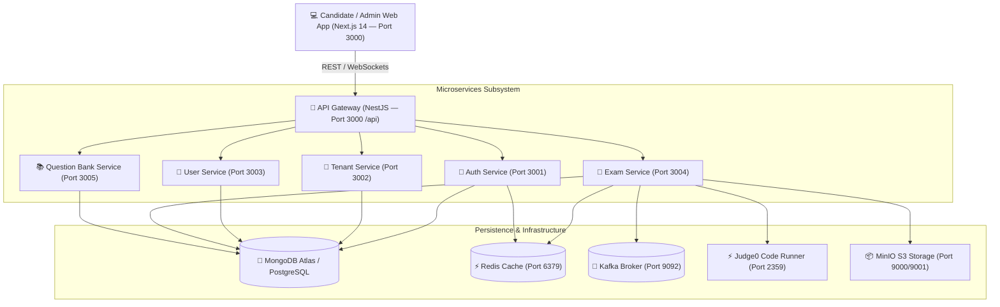

<div align="center">

# 🎓 Xe-Recruiters
### *Enterprise-Grade AI-Proctored Examination & Coding Assessment Platform*

[](https://turbo.build/)
[](https://nextjs.org/)
[](https://nodejs.org/)
[](https://www.typescriptlang.org/)
[](https://www.mongodb.com/)
[](https://www.docker.com/)

[Key Features](#-key-features) • [Architecture](#-system-architecture) • [Quick Start](#-quick-start-guide) • [Microservices](#-microservices--port-matrix) • [Seeded Accounts](#-seeded-test-accounts) • [Documentation](#-end-to-end-workflows)

---

</div>

## 📌 Executive Summary

**Xe-Recruiters** is an enterprise-ready, multi-tenant examination and technical assessment platform. Built on a distributed microservices architecture managed via **Turborepo**, the system delivers automated real-time AI proctoring, live human proctor supervision, interactive code compilation (via Judge0 CE), automated grading pipelines, dynamic PDF certification, and complete administrative governance.

---

## 🌟 Key Features

### 🤖 1. AI-Powered Automated Proctoring
> [!IMPORTANT]
> The automated proctoring suite continuously evaluates candidate behavior and calculates a dynamic, real-time **Trust Score (0–100%)**.

- **Facial Recognition & Presence Verification**: Detects missing candidates, extra faces in frame, or identity swaps.
- **Gaze & Head Pose Tracking**: Flags off-screen glances or head rotations exceeding configured duration thresholds.
- **Browser Focus Enforcement**: Monitors tab switching (`TAB_SWITCH`), window blurring, and full-screen exits (`FULLSCREEN_EXIT`).
- **Keyboard Shortcut Blocking**: Disables copy/paste operations and unauthorized system shortcuts.
- **Ambient Audio Monitoring**: Real-time microphone frequency analysis detecting voice activity or background noise spikes.

### 👁️ 2. Live Human Proctoring Console
- **Real-Time Video Grid**: Multi-feed WebSocket streaming room for active proctor supervision.
- **Severity-Weighted Timeline**: Automated flag categorization (`LOW`, `MEDIUM`, `HIGH`, `CRITICAL`).
- **Active Session Controls**: Direct candidate warnings, temporary test pauses, or emergency termination.

### 💻 3. Code Execution Engine (Judge0 CE Integration)
- **Multi-Language IDE**: Interactive coding environment supporting Python, JavaScript, C++, and Java.
- **Automated Test Case Runner**: Executes candidate code against visible and hidden test cases, returning runtime execution metrics, stdout, stderr, and memory usage.

### 📚 4. Dynamic Item Bank & Exam Engine
- **Item Formats**: Multiple Choice Questions (MCQs), Coding Challenges, and Subjective/Descriptive assessments.
- **Taxonomy & Tagging**: Category hierarchies, difficulty levels (Easy, Medium, Hard), and skill tags.
- **Navigation Rules**: Linear or free-navigation exam sections with randomized questions and option shuffling.

### 📜 5. Automated PDF Certificate Engine
- **Dynamic PDF Generation**: Generates cryptographically verifiable completion certificates with QR verification hashes, score breakdowns, and candidate metadata.

### 🏢 6. Multi-Tenancy & 5-Tier RBAC
- **Tenant Isolation**: Custom branding, domain routing, and seat licensing per organization.
- **Role Permissions**:
  - 🛡️ `PLATFORM_ADMIN`: Global platform infrastructure administrator.
  - 🏢 `TENANT_ADMIN`: Organization account manager and user administrator.
  - 🎓 `TEACHER`: Exam author, question banker, and evaluation reviewer.
  - 👁️ `PROCTOR`: Real-time session supervisor and flag reviewer.
  - 🧑‍🎓 `CANDIDATE`: Assessment test taker.

### 🛡️ 7. Security, Compliance & Governance
- **GDPR DSAR Management**: Tools for handling Data Subject Access Requests (data export & deletion).
- **Security Audit Logs**: Tamper-resistant system audit trails capturing login attempts, configuration updates, and administrative actions.

---

## 📐 System Architecture



---

## 📁 Repository Structure

```text
.
├── frontend/                # Next.js 14 App Router Application (Tailwind CSS, Zustand, Lucide)
├── services/
│   ├── api-gateway/         # NestJS Unified Gateway (REST Routing, Rate Limiting, Auth Middleware)
│   ├── auth-service/        # Authentication, JWT Tokens & Password Reset Flows
│   ├── tenant-service/      # Tenancy Management, Subscriptions & Domain Mapping
│   ├── user-service/        # User Accounts, RBAC Governance & Candidate Profiles
│   ├── exam-service/        # Exam Engine, Proctoring Websockets, Scoring & PDF Certs
│   └── question-bank-service/# Item Bank Management (MCQs, Coding, Subjective)
├── packages/
│   ├── shared-types/        # Shared TypeScript Interfaces across all Monorepo Workspaces
│   └── shared-utils/        # Centralized Logger, Custom Errors & Helper Utilities
├── docker-compose.yml       # Infrastructure Stack (Postgres, Redis, Kafka, MinIO, Judge0)
├── seed_real_proctor_data.js# Enterprise Data Seeding Script (Tenants, Exams, Proctor Logs)
└── package.json             # Turborepo Workspace Configuration
```

---

## 🚀 Quick Start Guide

### Prerequisites
- **Node.js**: `>= 20.0.0`
- **npm**: `>= 10.0.0`
- **Docker Desktop**: Installed and running

---

### Step-by-Step Method 1: Installation WITH Docker (Recommended)

#### 1. Clone Repository & Navigate to Project
```bash
git clone https://gitlab.com/xebia-exam-platform/group-c/design.git
cd design/xebia-exam-platform
```

#### 2. Install Monorepo Dependencies
Since `node_modules` is excluded from Git, install all project dependencies:
```bash
npm install
```

#### 3. Environment Variables Setup
Environment configuration files (`.env`) are included in the repository. If creating custom environment files:
```bash
cp .env.example .env
cp .env.example frontend/.env.local
```

#### 4. Start Infrastructure Stack (Docker)
Launch Redis (`6379`), Kafka (`9092`), MinIO (`9000/9001`), and Judge0 (`2359`) containers:
```bash
npm run docker:up
```

#### 5. Seed Database & Real Proctoring Sessions
Populate database with sample tenants, exams, questions, and proctoring session logs:
```bash
node seed_real_proctor_data.js
```

#### 6. Launch Microservices & Web Portal
Start all microservices and the Next.js 14 frontend concurrently via Turborepo:
```bash
npm run dev
```

> 🌐 Open **[http://localhost:3000](http://localhost:3000)** in your browser!

---

### Step-by-Step Method 2: Installation WITHOUT Docker (Standalone / Cloud Database)

If Docker is not running or available on your system, follow these steps to run the application using local installed services or cloud database connections (like MongoDB Atlas):

#### 1. Clone Repository & Navigate to Project
```bash
git clone https://gitlab.com/xebia-exam-platform/group-c/design.git
cd design/xebia-exam-platform
```

#### 2. Install Monorepo Dependencies
Install all project dependencies across the workspace:
```bash
npm install
```

#### 3. Configure Local or Cloud Connections (`.env`)
Verify or update the connection strings in `.env` and `frontend/.env.local` to point to your local or cloud services:
```env
# MongoDB Connection String (MongoDB Atlas Cloud or local mongodb://localhost:27017/xebia_exam)
DATABASE_URL="mongodb+srv://<username>:<password>@cluster0.mongodb.net/xebia_exam?retryWrites=true&w=majority"

# Redis Server Connection (Local Redis or Cloud Redis)
REDIS_HOST="127.0.0.1"
REDIS_PORT=6379

# Code Execution Engine (Judge0)
JUDGE0_API_URL="http://localhost:2359"
```

#### 4. Seed Database Records
Run the database seed script to populate sample test data, users, and exams:
```bash
node seed_real_proctor_data.js
```

#### 5. Launch Microservices & Web Portal
Launch all microservices and Next.js 14 application concurrently:
```bash
npm run dev
```

> 🌐 Open **[http://localhost:3000](http://localhost:3000)** in your browser!

---

## 🌐 Microservices & Port Matrix

| Service | Directory | Port | Base URL / Path | Description |
| :--- | :--- | :--- | :--- | :--- |
| **Next.js Web Portal** | `frontend/` | `3000` | `http://localhost:3000` | Candidate & Admin Frontend Portal |
| **API Gateway** | `services/api-gateway/` | `3000` | `http://localhost:3000/api` | Microservice Routing & Middleware |
| **Auth Service** | `services/auth-service/` | `3001` | `http://localhost:3001` | JWT Authentication & Sessions |
| **Tenant Service** | `services/tenant-service/` | `3002` | `http://localhost:3002` | Organization Tenancy Engine |
| **User Service** | `services/user-service/` | `3003` | `http://localhost:3003` | User Administration & RBAC |
| **Exam Service** | `services/exam-service/` | `3004` | `http://localhost:3004` | Exam Engine, Proctoring & PDF Certs |
| **Question Bank Service** | `services/question-bank-service/` | `3005` | `http://localhost:3005` | Question Bank Repository |
| **MinIO S3 Console** | `docker-compose` | `9001` | `http://localhost:9001` | Object Storage Console |
| **Judge0 Code Executor** | `docker-compose` | `2359` | `http://localhost:2359` | High-Performance Code Compiler |

---

## 🔑 Seeded Test Accounts

> **Universal Test Password for all accounts:** `Admin@123`

| Role | Email Address | Password | Primary Workflow |
| :--- | :--- | :--- | :--- |
| 🛡️ **Platform Admin** | `admin@acme.edu` | `Admin@123` | Global platform administration, tenant provisioning, system security audit |
| 🏢 **Tenant Admin** | `tenantadmin@acme.edu` | `Admin@123` | Acme University tenant setup, user provisioning, domain mapping |
| 🎓 **Teacher** | `teacher@acme.edu` | `Admin@123` | Exam creation, item authoring, manual evaluation |
| 👁️ **Lead Proctor** | `proctor@acme.edu` | `Admin@123` | Real-time proctor monitoring room, live flag reviews, session intervention |
| 👁️ **Senior Proctor** | `proctor@xebia.com` | `Admin@123` | Secondary proctor monitor |
| 🧑‍🎓 **Candidate 1** | `john.doe@student.acme.edu` | `Admin@123` | Student test-taker, interactive coding IDE, completion certificates |
| 🧑‍🎓 **Candidate 2** | `alex.smith@student.acme.edu` | `Admin@123` | Student test-taker candidate |

---

## 🔄 End-to-End Workflows

### 1. Candidate Exam Execution
1. Log in as `john.doe@student.acme.edu` (`Admin@123`).
2. Navigate to **Exams** -> Select active exam (*Full Stack Engineering Assessment*).
3. Pass camera, audio, and browser setup checks.
4. Solve MCQs and code in the integrated IDE with real-time test execution.
5. Submit exam and receive instant score report & PDF certificate.

### 2. Live Human Proctoring
1. Log in as `proctor@acme.edu` (`Admin@123`).
2. Access **Dashboard** -> **Proctoring**.
3. View real-time active video streams and candidate trust scores.
4. Inspect flagged incidents and take action (warn candidate, pause, or terminate test).

---

## 🛠️ CLI Script Reference

| Command | Action |
| :--- | :--- |
| `npm run dev` | Launch all microservices & frontend concurrently via Turborepo |
| `npm run build` | Build production bundles across all packages and services |
| `npm run test` | Run unit & integration test suites across monorepo |
| `npm run lint` | Execute ESLint static analysis across workspace |
| `npm run typecheck` | Perform strict TypeScript type checking |
| `npm run docker:up` | Spin up infrastructure containers (Redis, Kafka, MinIO, Judge0) |
| `npm run docker:down` | Stop background infrastructure containers |
| `npm run docker:reset` | Reset containers and clear persistent volumes |
| `node seed_real_proctor_data.js` | Populate MongoDB Atlas with realistic enterprise test data |

---

## 📄 License

Copyright © 2024 Xe-Recruiters. All rights reserved.
